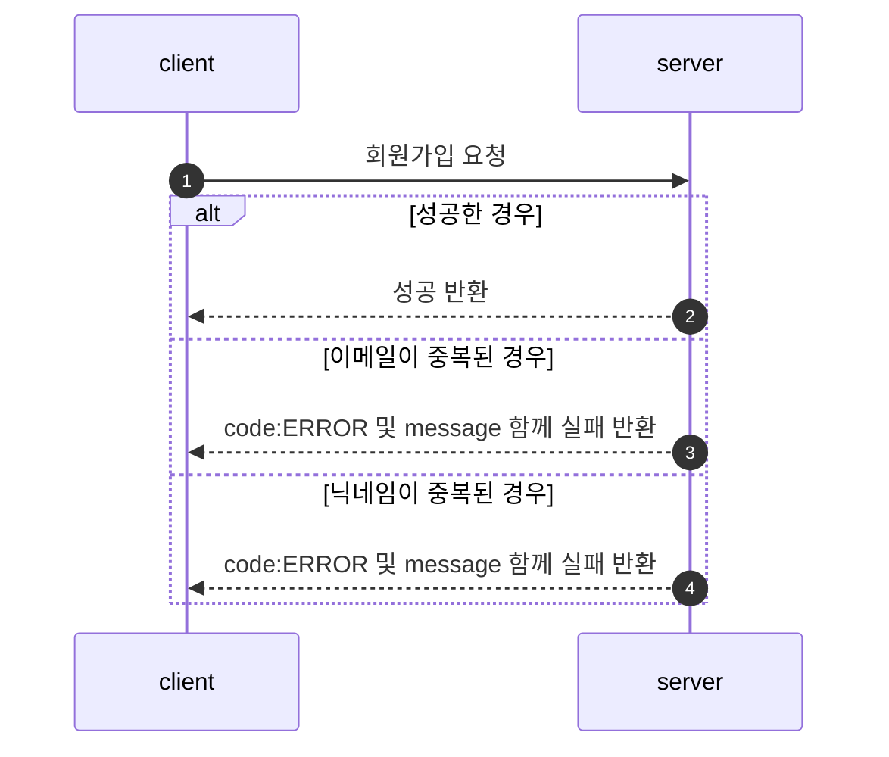
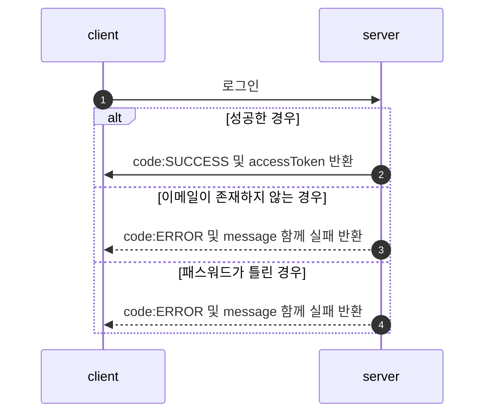
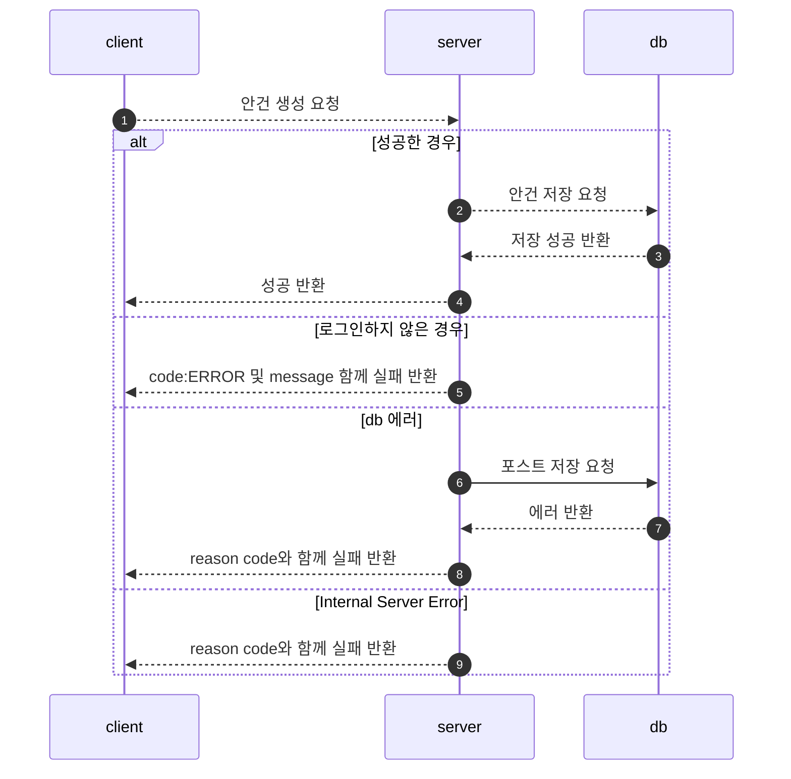
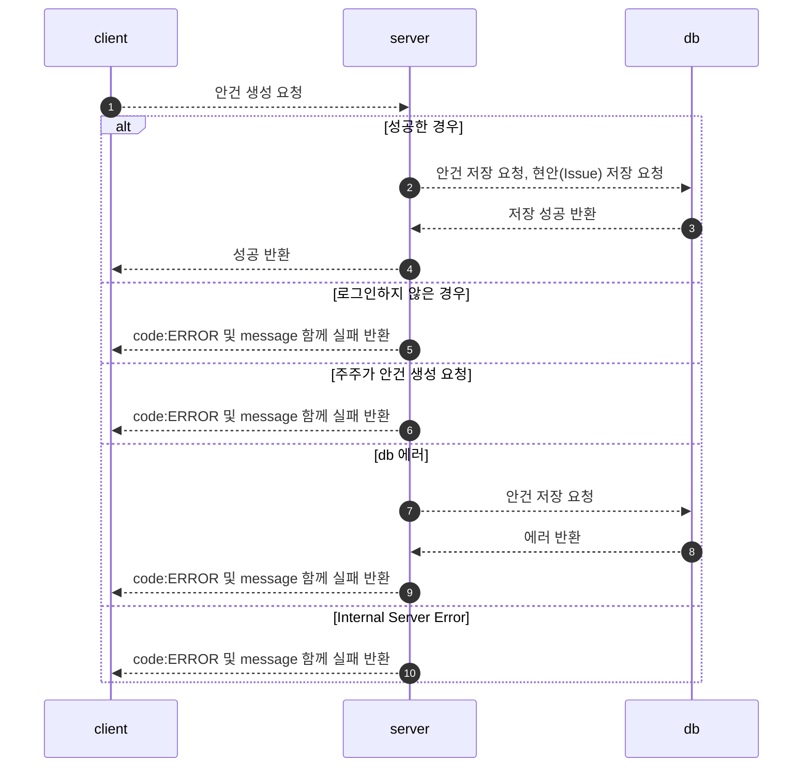
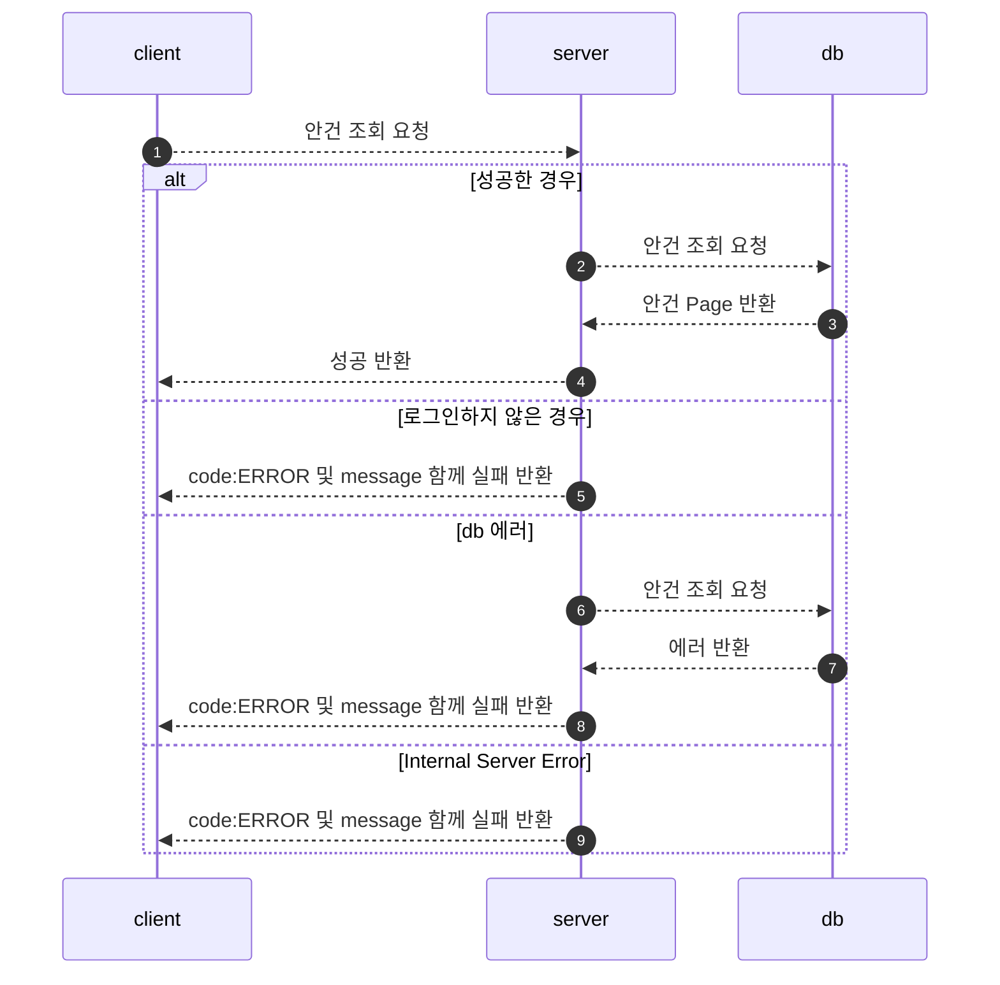
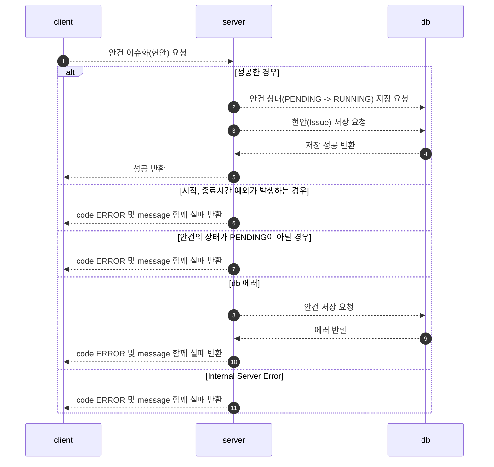
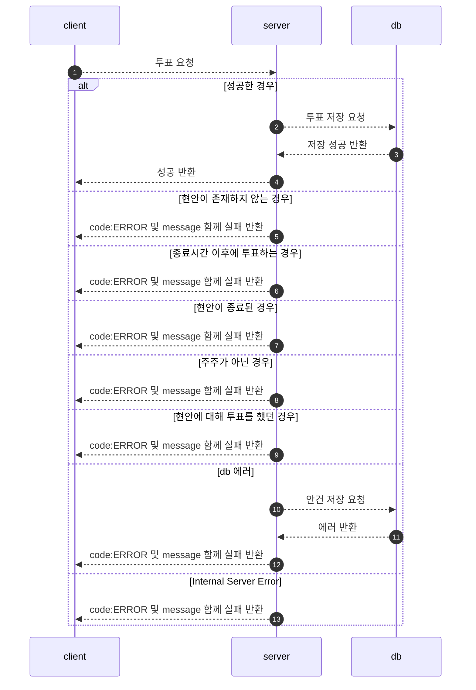

## 개발 환경

- Java 11
- Spring Boot 2.7.7
- Mysql:8.0.31 (docker)
- querydsl:5.0.0

<br/>

## 기술 세부 스택

- Spring Web
- Spring Data JPA
- MySQL Driver
- Spring Security (AccessToken 발급)
    - accessToken을 발급 후 매 요청이 들어올 때마다 이를 검증
    - 검증된 유저는 Spring Security Context 에 주입한다. 이를 통해 Context에 담긴 정보를 통해 인증/인가를 구현

<br/>

## ERD


## 도메인

### 안건(Agenda)

---

```
- id(pk)
- 관리자 id
- 안건의 제목
- 안건의 본문
- 안건의 상태(PENDING, RUNNING, COMPLETED)
  - PENDING: 안건만 존재하고 현안으로 승격이 안됨 (issue화(x))
  - RUNNING: 안건 -> 현안 (issue화(O))
  - COMPLETED: 현안의 종료일시가 현재 시간 보다 늦을시 종료(Scheduled), 또는 제한 투표할시에 마지막 투표 이후 닫힘(API, Scheduled)
- metaData : 생성일시, 수정 일시
```

<br/>

### 현안(Issue)

---

```
- id(pk)
- 안건의 id
- 현안의 종류 
  - LIMITED: 선착순 투표 방식
  - NO_LIMITED: 무제한 투표 방식

- 현안의 상태:
  - OPEN(현재 진행중인 현안)
  - CLOSE(종료된 현안)
- 현안의 시작 시간, 종료 시간
- metadata : 생성일시, 수정 일시
```

<br/>

### 투표(vote)

---

```
- id(pk)
- 현안의 id
- 투표자의 id
- 투표의 종류
  - YES: 찬성
  - NO: 반대
  - GIVE_UP: 기권
- 투표자가 행사한 의결권 수
- metadata: 생성일시 
```

<br/>

### 사용자

```
- 이메일
- 비밀번호(bcrypt)
- 닉네임
- 사용자 권한
- 의결권 갯수 (명시하지 않고 생성할 시에 default 값 1개)
- metadata: 생성일시, 수정 일시
```

<br/>

## API 명세서
<a target="_blank" href="https://documenter.getpostman.com/view/19374874/2s8ZDR75n4">
API 명세서</a>

<br/>

## FlowChart

### 회원가입

---



**회원가입 성공**


**이메일이 중복되는 경우**


**닉네임이 중복되는 경우**


<br/>

### 로그인

---



**로그인 성공**

**이메일이 존재하지 않는 경우**

**패스워드가 틀린 경우**


## 안건

### 안건 생성(Pending)

---



**관리자가 안건을 생성할 때**


**주주가 안건을 생성할 때**


### 안건 생성(Running)

---



**관리자가 안건을 생성할 때**


**주주가 안건을 생성할 때**


<br/>


### 안건 조회(상태값과 함께 조회 가능)

---



**안건 상태값과 함께 조회(주주, 관리자 상관 없이 동일한 조회 Page)**


**안건 전체 조회**


<details>
<summary>[IssueStatus Pending 조회 쿼리]</summary>
<div markdown="1">

- `{{url}}/api/v1/agendas?agendaStatus=PENDING&page=0&size=3`
- `join fetch i.agenda` + QueryDSL

```mysql
2023-01-14 22:04:51.793  INFO 60612 --- [nio-8080-exec-8] p6spy                                    :
-- Ids QUERY 
    select
        agenda0_.id as col_0_0_ 
    from
        agenda agenda0_ 
    where
        agenda0_.agenda_status='PENDING' limit 3

	Connection ID:56 | Execution Time:3 ms

	Execution Time:3 ms

	Call Stack :
		1.gabia.jaime.voting.global.security.JwtTokenFilter.doFilterInternal(JwtTokenFilter.java:66)
		2.gabia.jaime.voting.domain.agenda.web.AgendaApiController.search(AgendaApiController.java:26)
		3.gabia.jaime.voting.domain.agenda.service.AgendaService$$EnhancerBySpringCGLIB$$e0e8d92e.search(<generated>)
		4.gabia.jaime.voting.domain.agenda.service.AgendaService$$FastClassBySpringCGLIB$$ea05dc43.invoke(<generated>)
		5.gabia.jaime.voting.domain.agenda.service.AgendaService.search(AgendaService.java:28)
		6.gabia.jaime.voting.domain.agenda.repository.AgendaRepositoryCustomImpl.findWithAgendaStatus(AgendaRepositoryCustomImpl.java:49)
		7.gabia.jaime.voting.global.p6spy.CustomP6spySqlFormat.formatMessage(CustomP6spySqlFormat.java:26)
		8.gabia.jaime.voting.global.p6spy.CustomP6spySqlFormat.createStack(CustomP6spySqlFormat.java:50)

--------------------------------------
2023-01-14 22:04:51.799  INFO 60612 --- [nio-8080-exec-8] p6spy                                    :
-- FETCH JOIN QUERY 
    select
        agenda0_.id as id1_0_0_,
        issue1_.id as id1_1_1_,
        agenda0_.created_at as created_2_0_0_,
        agenda0_.modified_at as modified3_0_0_,
        agenda0_.agenda_status as agenda_s4_0_0_,
        agenda0_.content as content5_0_0_,
        agenda0_.member_id as member_i7_0_0_,
        agenda0_.title as title6_0_0_,
        issue1_.created_at as created_2_1_1_,
        issue1_.modified_at as modified3_1_1_,
        issue1_.agenda_id as agenda_11_1_1_,
        issue1_.end_at as end_at4_1_1_,
        issue1_.give_up_count as give_up_5_1_1_,
        issue1_.issue_status as issue_st6_1_1_,
        issue1_.issue_type as issue_ty7_1_1_,
        issue1_.no_count as no_count8_1_1_,
        issue1_.start_at as start_at9_1_1_,
        issue1_.yes_count as yes_cou10_1_1_ 
    from
        agenda agenda0_ 
    left outer join
        issue issue1_ 
            on agenda0_.id=issue1_.agenda_id 
    where
        agenda0_.id in (
            5 , 6 , 7
        )

	Connection ID:56 | Execution Time:4 ms

	Execution Time:4 ms

	Call Stack :
		1.gabia.jaime.voting.global.security.JwtTokenFilter.doFilterInternal(JwtTokenFilter.java:66)
		2.gabia.jaime.voting.domain.agenda.web.AgendaApiController.search(AgendaApiController.java:26)
		3.gabia.jaime.voting.domain.agenda.service.AgendaService$$EnhancerBySpringCGLIB$$e0e8d92e.search(<generated>)
		4.gabia.jaime.voting.domain.agenda.service.AgendaService$$FastClassBySpringCGLIB$$ea05dc43.invoke(<generated>)
		5.gabia.jaime.voting.domain.agenda.service.AgendaService.search(AgendaService.java:28)
		6.gabia.jaime.voting.domain.agenda.repository.AgendaRepositoryCustomImpl.findWithAgendaStatus(AgendaRepositoryCustomImpl.java:54)
		7.gabia.jaime.voting.global.p6spy.CustomP6spySqlFormat.formatMessage(CustomP6spySqlFormat.java:26)
		8.gabia.jaime.voting.global.p6spy.CustomP6spySqlFormat.createStack(CustomP6spySqlFormat.java:50)

--------------------------------------
-- COUNT QUERY
2023-01-14 22:04:51.803  INFO 60612 --- [nio-8080-exec-8] p6spy                                    : 
    select
        count(agenda0_.id) as col_0_0_ 
    from
        agenda agenda0_ 
    where
        agenda0_.agenda_status='PENDING'

	Connection ID:56 | Execution Time:1 ms

	Execution Time:1 ms

	Call Stack :
		1.gabia.jaime.voting.global.security.JwtTokenFilter.doFilterInternal(JwtTokenFilter.java:66)
		2.gabia.jaime.voting.domain.agenda.web.AgendaApiController.search(AgendaApiController.java:26)
		3.gabia.jaime.voting.domain.agenda.service.AgendaService$$EnhancerBySpringCGLIB$$e0e8d92e.search(<generated>)
		4.gabia.jaime.voting.domain.agenda.service.AgendaService$$FastClassBySpringCGLIB$$ea05dc43.invoke(<generated>)
		5.gabia.jaime.voting.domain.agenda.service.AgendaService.search(AgendaService.java:28)
		6.gabia.jaime.voting.domain.agenda.repository.AgendaRepositoryCustomImpl.findWithAgendaStatus(AgendaRepositoryCustomImpl.java:58)
		7.gabia.jaime.voting.global.p6spy.CustomP6spySqlFormat.formatMessage(CustomP6spySqlFormat.java:26)
		8.gabia.jaime.voting.global.p6spy.CustomP6spySqlFormat.createStack(CustomP6spySqlFormat.java:50)

--------------------------------------
2023-01-14 22:04:51.804  INFO 60612 --- [nio-8080-exec-8] p6spy                                    : 

```
</div>
</details>

<details>
<summary>[IssueStatus 없이 조회 쿼리]</summary>
<div markdown="1">

- `{{url}}/api/v1/agendas?page=1&size=10`
-  커버링 인덱스 + `join fetch i.agenda` + QueryDSL

```sql
2023-01-14 22:07:58.306  INFO 60612 --- [nio-8080-exec-1] p6spy                                    : 
    select
        agenda0_.id as col_0_0_ 
    from
        agenda agenda0_ limit 10,
        10

	Connection ID:60 | Execution Time:2 ms

	Execution Time:2 ms

	Call Stack :
		1.gabia.jaime.voting.global.security.JwtTokenFilter.doFilterInternal(JwtTokenFilter.java:66)
		2.gabia.jaime.voting.domain.agenda.web.AgendaApiController.search(AgendaApiController.java:26)
		3.gabia.jaime.voting.domain.agenda.service.AgendaService$$EnhancerBySpringCGLIB$$e0e8d92e.search(<generated>)
		4.gabia.jaime.voting.domain.agenda.service.AgendaService$$FastClassBySpringCGLIB$$ea05dc43.invoke(<generated>)
		5.gabia.jaime.voting.domain.agenda.service.AgendaService.search(AgendaService.java:25)
		6.gabia.jaime.voting.domain.agenda.repository.AgendaRepositoryCustomImpl.findWithoutAgendaStatus(AgendaRepositoryCustomImpl.java:30)
		7.gabia.jaime.voting.global.p6spy.CustomP6spySqlFormat.formatMessage(CustomP6spySqlFormat.java:26)
		8.gabia.jaime.voting.global.p6spy.CustomP6spySqlFormat.createStack(CustomP6spySqlFormat.java:50)

--------------------------------------
2023-01-14 22:07:58.310  INFO 60612 --- [nio-8080-exec-1] p6spy                                    : 
    select
        agenda0_.id as id1_0_0_,
        issue1_.id as id1_1_1_,
        agenda0_.created_at as created_2_0_0_,
        agenda0_.modified_at as modified3_0_0_,
        agenda0_.agenda_status as agenda_s4_0_0_,
        agenda0_.content as content5_0_0_,
        agenda0_.member_id as member_i7_0_0_,
        agenda0_.title as title6_0_0_,
        issue1_.created_at as created_2_1_1_,
        issue1_.modified_at as modified3_1_1_,
        issue1_.agenda_id as agenda_11_1_1_,
        issue1_.end_at as end_at4_1_1_,
        issue1_.give_up_count as give_up_5_1_1_,
        issue1_.issue_status as issue_st6_1_1_,
        issue1_.issue_type as issue_ty7_1_1_,
        issue1_.no_count as no_count8_1_1_,
        issue1_.start_at as start_at9_1_1_,
        issue1_.yes_count as yes_cou10_1_1_ 
    from
        agenda agenda0_ 
    left outer join
        issue issue1_ 
            on agenda0_.id=issue1_.agenda_id 
    where
        agenda0_.id in (
            11 , 12 , 13 , 14 , 15 , 16 , 17 , 18 , 19 , 20
        )

	Connection ID:60 | Execution Time:2 ms

	Execution Time:2 ms

	Call Stack :
		1.gabia.jaime.voting.global.security.JwtTokenFilter.doFilterInternal(JwtTokenFilter.java:66)
		2.gabia.jaime.voting.domain.agenda.web.AgendaApiController.search(AgendaApiController.java:26)
		3.gabia.jaime.voting.domain.agenda.service.AgendaService$$EnhancerBySpringCGLIB$$e0e8d92e.search(<generated>)
		4.gabia.jaime.voting.domain.agenda.service.AgendaService$$FastClassBySpringCGLIB$$ea05dc43.invoke(<generated>)
		5.gabia.jaime.voting.domain.agenda.service.AgendaService.search(AgendaService.java:25)
		6.gabia.jaime.voting.domain.agenda.repository.AgendaRepositoryCustomImpl.findWithoutAgendaStatus(AgendaRepositoryCustomImpl.java:35)
		7.gabia.jaime.voting.global.p6spy.CustomP6spySqlFormat.formatMessage(CustomP6spySqlFormat.java:26)
		8.gabia.jaime.voting.global.p6spy.CustomP6spySqlFormat.createStack(CustomP6spySqlFormat.java:50)

--------------------------------------
2023-01-14 22:07:58.325  INFO 60612 --- [nio-8080-exec-1] p6spy                                    : 
    select
        count(agenda0_.id) as col_0_0_ 
    from
        agenda agenda0_

	Connection ID:60 | Execution Time:13 ms

	Execution Time:13 ms

	Call Stack :
		1.gabia.jaime.voting.global.security.JwtTokenFilter.doFilterInternal(JwtTokenFilter.java:66)
		2.gabia.jaime.voting.domain.agenda.web.AgendaApiController.search(AgendaApiController.java:26)
		3.gabia.jaime.voting.domain.agenda.service.AgendaService$$EnhancerBySpringCGLIB$$e0e8d92e.search(<generated>)
		4.gabia.jaime.voting.domain.agenda.service.AgendaService$$FastClassBySpringCGLIB$$ea05dc43.invoke(<generated>)
		5.gabia.jaime.voting.domain.agenda.service.AgendaService.search(AgendaService.java:25)
		6.gabia.jaime.voting.domain.agenda.repository.AgendaRepositoryCustomImpl.findWithoutAgendaStatus(AgendaRepositoryCustomImpl.java:39)
		7.gabia.jaime.voting.global.p6spy.CustomP6spySqlFormat.formatMessage(CustomP6spySqlFormat.java:26)
		8.gabia.jaime.voting.global.p6spy.CustomP6spySqlFormat.createStack(CustomP6spySqlFormat.java:50)

--------------------------------------
2023-01-14 22:07:58.329  INFO 60612 --- [nio-8080-exec-1] p6spy                                    : 
```
</div>
</details>


<details>
<summary>Summer 님의 README.md를 보고 커버링 인덱스 방법을 적용 (Agenda_status 가 없는 경우)</summary>
<div markdown="1">

[데이터베이스-인덱스](https://tecoble.techcourse.co.kr/post/2021-09-18-db-index/) <br/>
[커버링 인덱스](https://tecoble.techcourse.co.kr/post/2021-10-12-covering-index/) <br/>
[커버링 인덱스는 모든 인덱스가 포함될 때만 유효하다](https://jojoldu.tistory.com/529) <br/>

이에 따라 agenda_status 또한 index를 추가한다. (agenda_status 는 그래도 변경이 많기에 이는 고민이 필요하다..)

처음 agenda_status를 index 를 추가하여 모든 page 처리를 하려했다.

그러나 agenda_status는 변경이 많은 컬럼이기에 index는 비효율적이라고 생각이 들어 

전체 조회일 때는 커버링 인덱스 방법(PK(index) 조회) ids를 통해서 조회, 조건 조회일 때는 그냥 조회를 하고 agenda_status를 index화 하지 않기로 하였다.(ids 인덱스 방법으로 조회 되지 않는다. agendaStatus가 인덱스가 아니기에)


</div>
</details>

<br/>

### 안건 이슈화(현안)

`PENDING -> RUNNING 상태 변화` + Agenda에 해당하는 issue 생성

---



**성공 반환**

**시작, 종료시간의 예외가 발생할 경우**

**안건의 상태가 PENDING이 아닐 경우**


## 투표

---

### 투표 하기(주주만 투표가 가능)

---



**정상 투표**


**제한 없는 투표에서 현안의 상태가 OPEN(SCHEDULE(30분) 되기전), 종료 시간은 현재시간보다 전인 경우**


**현안에 대해 이전에 투표 했던 경우**


**관리자가 투표할 경우 예외**


### 현안(Issue) 조회

---

**주주가 조회 ❗️**


**관리자가 조회 ❗️**

**issue 와 관련된 투표들 까지 조회**


<br/>

### Schedule

매 30분 마다 Issue 의 상태가 OPEN 이면서, 종료시간이 현재시간보다 전이면 issue 상태를 CLOSE,
안건 상태를 COMPLETED 로 변경

---

### 이전 상황


### Schedule 작업

```sql
2023-01-14 23:54:00.004  INFO 70589 --- [   scheduling-1] g.j.v.d.issue.schedule.IssueScheduler    : 스케줄러 시작 시간 = 2023-01-14T23:54:00.003780
2023-01-14 23:54:00.082  INFO 70589 --- [   scheduling-1] p6spy                                    : 
    select
        issue0_.id as id1_1_0_,
        agenda1_.id as id1_0_1_,
        issue0_.created_at as created_2_1_0_,
        issue0_.modified_at as modified3_1_0_,
        issue0_.agenda_id as agenda_11_1_0_,
        issue0_.end_at as end_at4_1_0_,
        issue0_.give_up_count as give_up_5_1_0_,
        issue0_.issue_status as issue_st6_1_0_,
        issue0_.issue_type as issue_ty7_1_0_,
        issue0_.no_count as no_count8_1_0_,
        issue0_.start_at as start_at9_1_0_,
        issue0_.yes_count as yes_cou10_1_0_,
        agenda1_.created_at as created_2_0_1_,
        agenda1_.modified_at as modified3_0_1_,
        agenda1_.agenda_status as agenda_s4_0_1_,
        agenda1_.content as content5_0_1_,
        agenda1_.member_id as member_i7_0_1_,
        agenda1_.title as title6_0_1_ 
    from
        issue issue0_ 
    inner join
        agenda agenda1_ 
            on issue0_.agenda_id=agenda1_.id 
    where
        issue0_.issue_status='OPEN' 
        and issue0_.end_at<='2023-01-14T23:54:00.003+0900'

	Connection ID:4 | Execution Time:18 ms

	Execution Time:18 ms

	Call Stack :
		1.gabia.jaime.voting.domain.issue.schedule.IssueScheduler.expiresIssue(IssueScheduler.java:32)
		2.gabia.jaime.voting.global.p6spy.CustomP6spySqlFormat.formatMessage(CustomP6spySqlFormat.java:26)
		3.gabia.jaime.voting.global.p6spy.CustomP6spySqlFormat.createStack(CustomP6spySqlFormat.java:50)

--------------------------------------
2023-01-14 23:54:00.127  INFO 70589 --- [   scheduling-1] p6spy                                    : 
    update
        issue 
    set
        issue_status='CLOSE' 
    where
        id in (
            3
        )

	Connection ID:5 | Execution Time:3 ms

	Execution Time:3 ms

	Call Stack :
		1.gabia.jaime.voting.domain.issue.schedule.IssueScheduler.expiresIssue(IssueScheduler.java:50)
		2.gabia.jaime.voting.global.p6spy.CustomP6spySqlFormat.formatMessage(CustomP6spySqlFormat.java:26)
		3.gabia.jaime.voting.global.p6spy.CustomP6spySqlFormat.createStack(CustomP6spySqlFormat.java:50)

--------------------------------------
2023-01-14 23:54:00.133  INFO 70589 --- [   scheduling-1] p6spy                                    : 
2023-01-14 23:54:00.148  INFO 70589 --- [   scheduling-1] p6spy                                    : 
    update
        agenda 
    set
        agenda_status='COMPLETED' 
    where
        id in (
            3
        )

	Connection ID:6 | Execution Time:4 ms

	Execution Time:4 ms

	Call Stack :
		1.gabia.jaime.voting.domain.issue.schedule.IssueScheduler.expiresIssue(IssueScheduler.java:51)
		2.gabia.jaime.voting.global.p6spy.CustomP6spySqlFormat.formatMessage(CustomP6spySqlFormat.java:26)
		3.gabia.jaime.voting.global.p6spy.CustomP6spySqlFormat.createStack(CustomP6spySqlFormat.java:50)

--------------------------------------
2023-01-14 23:54:00.154  INFO 70589 --- [   scheduling-1] p6spy                                    : 
2023-01-14 23:54:00.155  INFO 70589 --- [   scheduling-1] g.j.v.d.issue.schedule.IssueScheduler    : 현안 종료, issueIds : [3]
2023-01-14 23:54:00.155  INFO 70589 --- [   scheduling-1] g.j.v.d.issue.schedule.IssueScheduler    : 현안 종료, agendaIds : [3]
```

### 이후 상황


```java
@Modifying
@Transactional
@Query("update Issue i set i.issueStatus = :status where i.id in :ids")
void updateStatusByIds(List<Long> ids, IssueStatus status);

@Modifying
@Transactional
@Query("update Agenda a set a.agendaStatus = :status where a.id in :ids")
void updateStatusByIds(List<Long> ids, AgendaStatus status);

```

---

```java
@Slf4j
@Component
@RequiredArgsConstructor
public class IssueScheduler {

    private final IssueRepository issueRepository;
    private final AgendaRepository agendaRepository;

    @Scheduled(cron = "0 0/30 * * * *")
    public void expiresIssue() {
        LocalDateTime now = LocalDateTime.now();
        log.info("스케줄러 시작 시간 = {}", now);

        List<Issue> expiredIssues = issueRepository.findWithAgendaByIssueStatusAndEndAtIsLessThanEqual(
                OPEN, now);

        if (expiredIssues.isEmpty()) {
            return;
        }

        expiredIssues.forEach(Issue::close);

        List<Long> issueIds = expiredIssues.stream()
                .map(Issue::getId)
                .collect(Collectors.toList());

        List<Long> agendaIds = expiredIssues.stream()
                .map(Issue::getAgenda)
                .map(Agenda::getId)
                .collect(Collectors.toList());

        issueRepository.updateStatusByIds(issueIds, CLOSE);
        agendaRepository.updateStatusByIds(agendaIds, COMPLETED);

        log.info("현안 종료, issueIds : {}", issueIds);
        log.info("현안 종료, agendaIds : {}", agendaIds);
    }
}
```


## 요구 사항 정리

* [x] 안건(Agenda) 생성 및 삭제, 상태 변경
    * ROLE_ADMIN 을 가진 관리자만 가능

* [x] 안건(`Agenda`) 조회
    * 모든 인가된 사용자는 조회가 가능하다.
    * Paging 처리

* [x] 무제한 투표
    * Issue 테이블 issue_type: NO_LIMITED
    * 시작 시간 종료 시간 사이에 투표가 가능하다.

* [x] 선착순 투표
    * Issue 테이블 issue_type: LIMITED
    * Vote 테이블에 기록을 남기고 vote_count를 차감하는 공유 자원, 이에 따라 `비관적 락`이 필요하다.
        * JPA (READ + COMMITTED + 낙관적 락): 레퍼런스 낙관적 락 예시에서 알 수 있듯이 `데드락`이 발생한다. (다대다 관계 테이블 + 공유 자원 (컬럼) 을 수정하기에)
    * 시작 시간 종료 시간 사이에 투표가 가능하다.
    

<details>
<summary>비관적 락</summary>
<div markdown="1">

JPA는 데이터베이스 트랜잭션 격리 수준을 READ COMMITTED 정도로 가정합니다.

만약 일부 로직에 더 높은 격리 수준이 필요하면 낙관적 락과 비관적 락 중 하나를 사용하면 됩니다.

이를 이해하기 위해서는 트랜잭션 격리 수준을 먼저 알아야합니다.

격리수준은 크게 4가지입니다.

- READ UNCOMMITTED
    - Commit 되지 않은 데이터를 읽을 수 있다.
    - Dirty Read 방지 (x), NonRepeatable read 방지 (x), Phantom Read 방지 (x)

- READ COMMITTED
    - Commit 된 데이터만 읽을 수 있다.

- **REPEATABLE READ** (✅)
    - Phantom Read가 발생할 수 있다
    - REPEATABLE READ는 변경(Update)는 제어하지만, INSERT는 제어할 수 없기 때문이다

- SERIALIZABLE
    - 모든 트랜잭션을 순서대로 실행한다.

> 발생할 수 있는 문제 <br/>
> - Dirty Read: `다른 트랜잭션에 의해 수정됐지만 아직 커밋되지 않은 데이터를 읽는 것`
> - Dirty Write: `같은 데이터에 동시에 두 개 이상의 트랜잭션이 값을 바꾸고자 함(갱신 분실)`
> - NonRepeatable Read: `동일 트랜잭션에서 동일한 대상을 여러번 읽을 때 그 사이에 수정 또는 삭제가 반영되어 값이 변경됨`
> - Phantom Read: `동일 트랜잭션에서 동일한 대상을 여러번 읽을 때 그 사이에 새로운 값(Phantom Tuple)이 삽입되어 값이 변경됨`

## Reference

- [발생할 수 있는 문제 레퍼런스](https://shorturl.at/iOSTU)
- [낙관적 락 예시](https://shorturl.at/hjl34)
- [비관적 락 예시](https://shorturl.at/hr246)
- [요약된 레퍼런스](https://modimodi.tistory.com/55)

</div>
</details>

* [ ]
