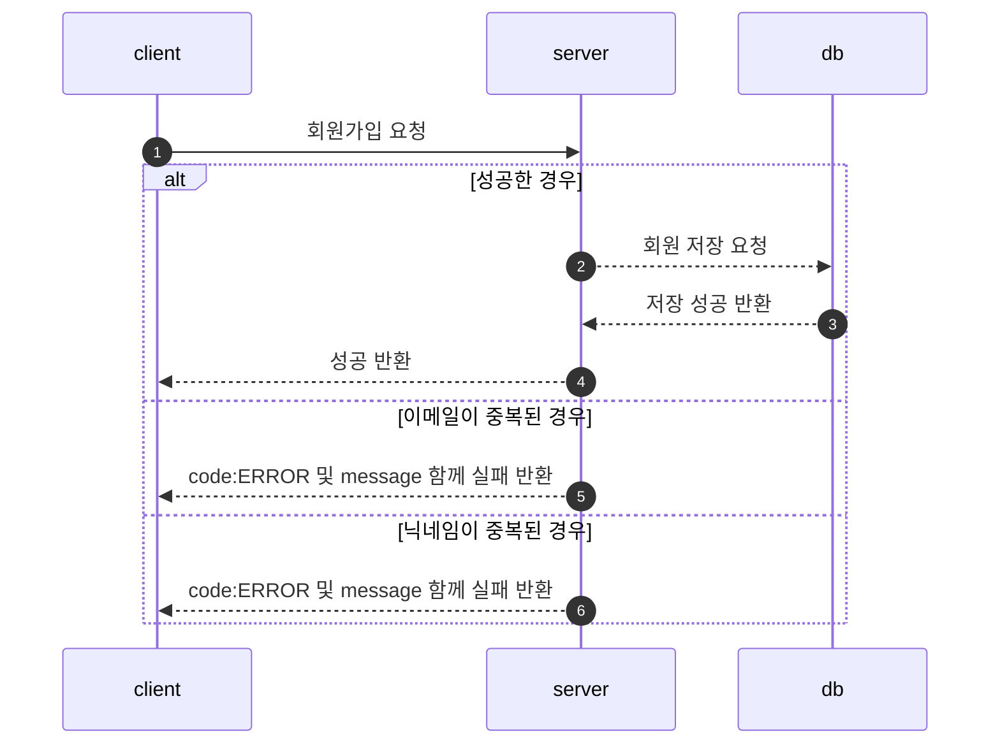
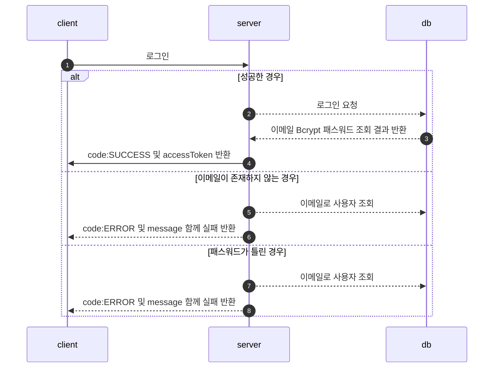
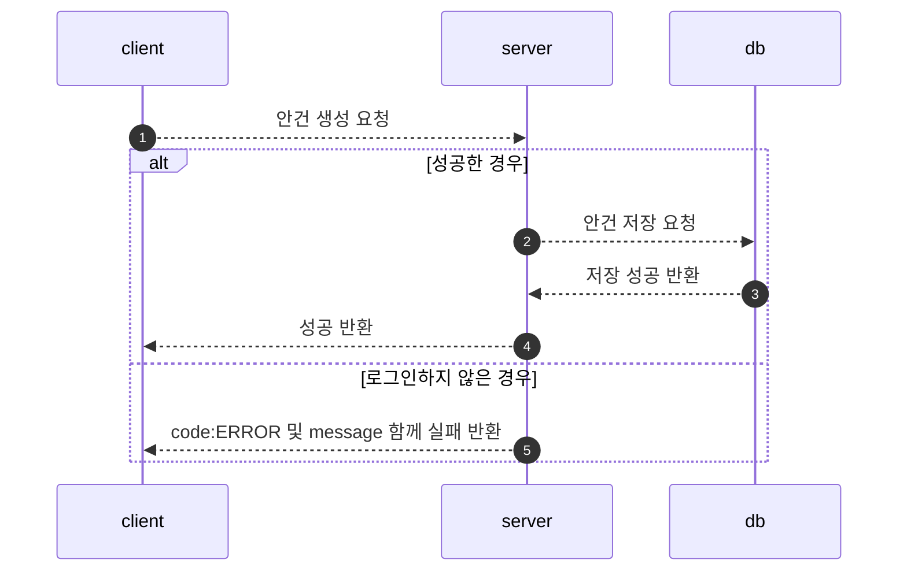
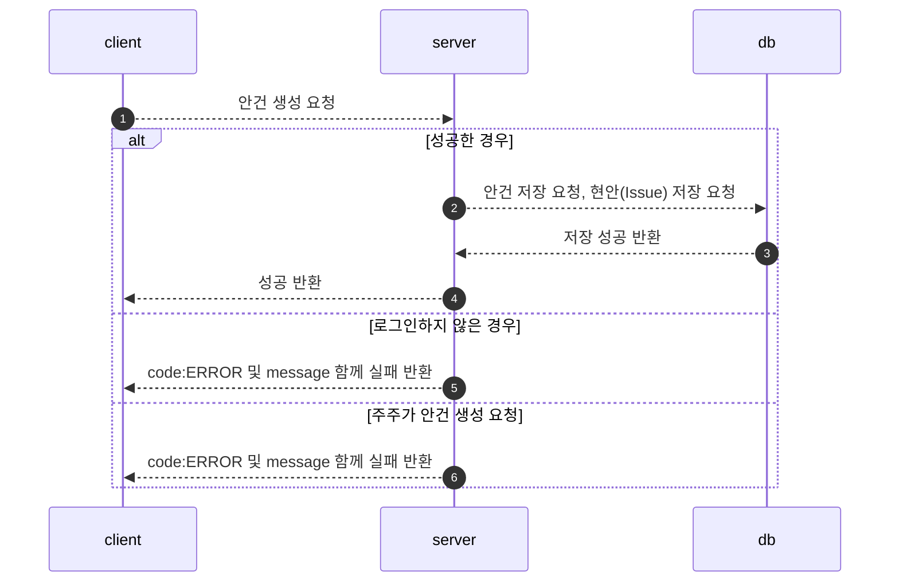
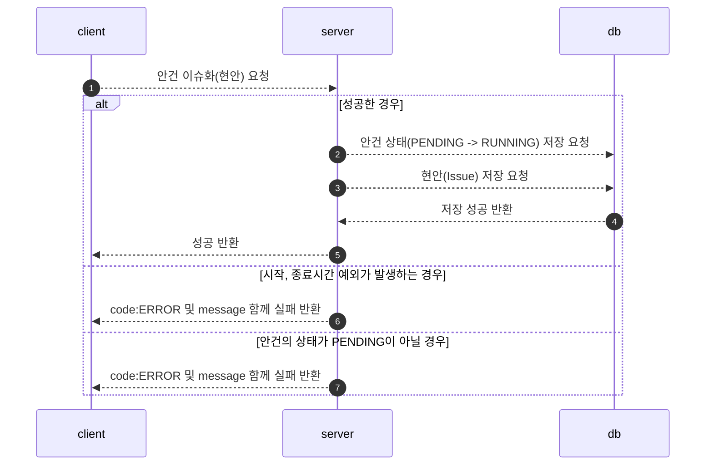
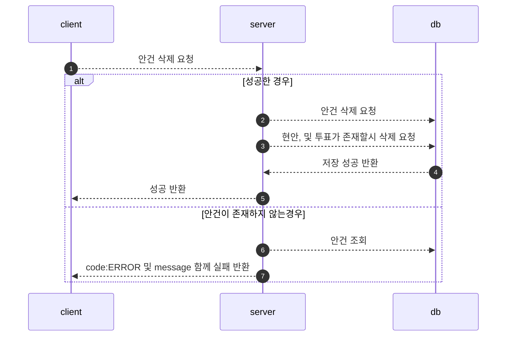
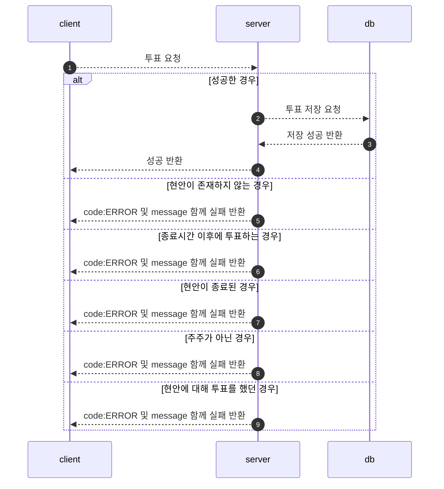

## 개발 환경

- Java 11
- Spring Boot 2.7.7
- Mysql:8.0.31 (docker)
- querydsl:5.0.0

<br/>

## 기술 세부 스택

- Spring Web
- Spring Data JPA
- MySQL Driver
- Spring Security (AccessToken 발급)
    - accessToken을 발급 후 매 요청이 들어올 때마다 이를 검증
    - 검증된 유저는 Spring Security Context 에 주입 
    - 이를 통해 Context에 담긴 정보를 통해 인증 및 인가를 구현

<br/>

## ERD


<br/>

## 도메인

### 안건(Agenda)

---

```
- id(pk)

- 관리자 id

- 안건의 제목

- 안건의 본문

- 안건의 상태(PENDING, RUNNING, COMPLETED)

  - PENDING: 안건만 존재하고 현안으로 승격이 안됨 (issue화(x))
  
  - RUNNING: 안건 -> 현안 (issue화(O))
  
  - COMPLETED: 현안의 종료일시가 현재 시간 보다 늦을시 종료(Scheduled), 또는 제한 투표할시에 마지막 투표 이후 닫힘(API, Scheduled)
  
- metaData : 생성일시, 수정 일시
```

<br/>

### 현안(Issue)

---

```
- id(pk)

- 안건의 id(@OneToOne)

- 현안의 종류 
  - LIMITED: 선착순 투표 방식
  - NO_LIMITED: 무제한 투표 방식
  
- 현안의 상태:
  - OPEN(현재 진행중인 현안)
  - CLOSE(종료된 현안)
  
- 현안의 시작 시간, 종료 시간

- metadata : 생성일시, 수정 일시
```

<br/>

### 투표(vote)

---

```
- id(pk)

- 현안의 id

- 투표자의 id

- 투표의 종류
  - YES: 찬성
  - NO: 반대
  - GIVE_UP: 기권
  
- 투표자가 행사한 의결권 수

- metadata: 생성일시 
```

<br/>

### 사용자

```
- 이메일

- 비밀번호(bcrypt)

- 닉네임

- 사용자 권한

- 의결권 갯수 (명시하지 않고 생성할 시에 default 값 1개)

- metadata: 생성일시, 수정 일시
```

<br/>

## API 명세서

---

<a target="_blank" href="https://documenter.getpostman.com/view/19374874/2s8ZDR75n4">
API 명세서</a>
<br/><br/>
<a target="_blank" href="https://haaeee.gitlab.io/">
RESTDOCS를 통한 컨트롤러 테스트 </a>

<br/>

## FlowChart

### 회원가입

---


<br/>

### 로그인

---



## 안건

### 안건 생성(Pending)

---




### 안건 생성(Running)

---



<br/>


### 안건 조회(상태값과 함께 조회 가능)

---


<details>
<summary>[IssueStatus Pending 조회 쿼리]</summary>
<div markdown="1">

- `{{url}}/api/v1/agendas?agendaStatus=PENDING&page=0&size=3`
- `join fetch i.agenda` + QueryDSL

```mysql
2023-01-14 22:04:51.793  INFO 60612 --- [nio-8080-exec-8] p6spy                                    :
-- Ids QUERY 
    select
        agenda0_.id as col_0_0_ 
    from
        agenda agenda0_ 
    where
        agenda0_.agenda_status='PENDING' limit 3

	Connection ID:56 | Execution Time:3 ms

	Execution Time:3 ms

	Call Stack :
		1.gabia.jaime.voting.global.security.JwtTokenFilter.doFilterInternal(JwtTokenFilter.java:66)
		2.gabia.jaime.voting.domain.agenda.web.AgendaApiController.search(AgendaApiController.java:26)
		3.gabia.jaime.voting.domain.agenda.service.AgendaService$$EnhancerBySpringCGLIB$$e0e8d92e.search(<generated>)
		4.gabia.jaime.voting.domain.agenda.service.AgendaService$$FastClassBySpringCGLIB$$ea05dc43.invoke(<generated>)
		5.gabia.jaime.voting.domain.agenda.service.AgendaService.search(AgendaService.java:28)
		6.gabia.jaime.voting.domain.agenda.repository.AgendaRepositoryCustomImpl.findWithAgendaStatus(AgendaRepositoryCustomImpl.java:49)
		7.gabia.jaime.voting.global.p6spy.CustomP6spySqlFormat.formatMessage(CustomP6spySqlFormat.java:26)
		8.gabia.jaime.voting.global.p6spy.CustomP6spySqlFormat.createStack(CustomP6spySqlFormat.java:50)

--------------------------------------
2023-01-14 22:04:51.799  INFO 60612 --- [nio-8080-exec-8] p6spy                                    :
-- FETCH JOIN QUERY 
    select
        agenda0_.id as id1_0_0_,
        issue1_.id as id1_1_1_,
        agenda0_.created_at as created_2_0_0_,
        agenda0_.modified_at as modified3_0_0_,
        agenda0_.agenda_status as agenda_s4_0_0_,
        agenda0_.content as content5_0_0_,
        agenda0_.member_id as member_i7_0_0_,
        agenda0_.title as title6_0_0_,
        issue1_.created_at as created_2_1_1_,
        issue1_.modified_at as modified3_1_1_,
        issue1_.agenda_id as agenda_11_1_1_,
        issue1_.end_at as end_at4_1_1_,
        issue1_.give_up_count as give_up_5_1_1_,
        issue1_.issue_status as issue_st6_1_1_,
        issue1_.issue_type as issue_ty7_1_1_,
        issue1_.no_count as no_count8_1_1_,
        issue1_.start_at as start_at9_1_1_,
        issue1_.yes_count as yes_cou10_1_1_ 
    from
        agenda agenda0_ 
    left outer join
        issue issue1_ 
            on agenda0_.id=issue1_.agenda_id 
    where
        agenda0_.id in (
            5 , 6 , 7
        )

	Connection ID:56 | Execution Time:4 ms

	Execution Time:4 ms

	Call Stack :
		1.gabia.jaime.voting.global.security.JwtTokenFilter.doFilterInternal(JwtTokenFilter.java:66)
		2.gabia.jaime.voting.domain.agenda.web.AgendaApiController.search(AgendaApiController.java:26)
		3.gabia.jaime.voting.domain.agenda.service.AgendaService$$EnhancerBySpringCGLIB$$e0e8d92e.search(<generated>)
		4.gabia.jaime.voting.domain.agenda.service.AgendaService$$FastClassBySpringCGLIB$$ea05dc43.invoke(<generated>)
		5.gabia.jaime.voting.domain.agenda.service.AgendaService.search(AgendaService.java:28)
		6.gabia.jaime.voting.domain.agenda.repository.AgendaRepositoryCustomImpl.findWithAgendaStatus(AgendaRepositoryCustomImpl.java:54)
		7.gabia.jaime.voting.global.p6spy.CustomP6spySqlFormat.formatMessage(CustomP6spySqlFormat.java:26)
		8.gabia.jaime.voting.global.p6spy.CustomP6spySqlFormat.createStack(CustomP6spySqlFormat.java:50)

--------------------------------------
-- COUNT QUERY
2023-01-14 22:04:51.803  INFO 60612 --- [nio-8080-exec-8] p6spy                                    : 
    select
        count(agenda0_.id) as col_0_0_ 
    from
        agenda agenda0_ 
    where
        agenda0_.agenda_status='PENDING'

	Connection ID:56 | Execution Time:1 ms

	Execution Time:1 ms

	Call Stack :
		1.gabia.jaime.voting.global.security.JwtTokenFilter.doFilterInternal(JwtTokenFilter.java:66)
		2.gabia.jaime.voting.domain.agenda.web.AgendaApiController.search(AgendaApiController.java:26)
		3.gabia.jaime.voting.domain.agenda.service.AgendaService$$EnhancerBySpringCGLIB$$e0e8d92e.search(<generated>)
		4.gabia.jaime.voting.domain.agenda.service.AgendaService$$FastClassBySpringCGLIB$$ea05dc43.invoke(<generated>)
		5.gabia.jaime.voting.domain.agenda.service.AgendaService.search(AgendaService.java:28)
		6.gabia.jaime.voting.domain.agenda.repository.AgendaRepositoryCustomImpl.findWithAgendaStatus(AgendaRepositoryCustomImpl.java:58)
		7.gabia.jaime.voting.global.p6spy.CustomP6spySqlFormat.formatMessage(CustomP6spySqlFormat.java:26)
		8.gabia.jaime.voting.global.p6spy.CustomP6spySqlFormat.createStack(CustomP6spySqlFormat.java:50)

--------------------------------------
2023-01-14 22:04:51.804  INFO 60612 --- [nio-8080-exec-8] p6spy                                    : 

```
</div>
</details>

<details>
<summary>[IssueStatus 없이 조회 쿼리]</summary>
<div markdown="1">

- `{{url}}/api/v1/agendas?page=1&size=10`
-  커버링 인덱스 + `join fetch i.agenda` + QueryDSL

```sql
2023-01-14 22:07:58.306  INFO 60612 --- [nio-8080-exec-1] p6spy                                    : 
    select
        agenda0_.id as col_0_0_ 
    from
        agenda agenda0_ limit 10,
        10

	Connection ID:60 | Execution Time:2 ms

	Execution Time:2 ms

	Call Stack :
		1.gabia.jaime.voting.global.security.JwtTokenFilter.doFilterInternal(JwtTokenFilter.java:66)
		2.gabia.jaime.voting.domain.agenda.web.AgendaApiController.search(AgendaApiController.java:26)
		3.gabia.jaime.voting.domain.agenda.service.AgendaService$$EnhancerBySpringCGLIB$$e0e8d92e.search(<generated>)
		4.gabia.jaime.voting.domain.agenda.service.AgendaService$$FastClassBySpringCGLIB$$ea05dc43.invoke(<generated>)
		5.gabia.jaime.voting.domain.agenda.service.AgendaService.search(AgendaService.java:25)
		6.gabia.jaime.voting.domain.agenda.repository.AgendaRepositoryCustomImpl.findWithoutAgendaStatus(AgendaRepositoryCustomImpl.java:30)
		7.gabia.jaime.voting.global.p6spy.CustomP6spySqlFormat.formatMessage(CustomP6spySqlFormat.java:26)
		8.gabia.jaime.voting.global.p6spy.CustomP6spySqlFormat.createStack(CustomP6spySqlFormat.java:50)

--------------------------------------
2023-01-14 22:07:58.310  INFO 60612 --- [nio-8080-exec-1] p6spy                                    : 
    select
        agenda0_.id as id1_0_0_,
        issue1_.id as id1_1_1_,
        agenda0_.created_at as created_2_0_0_,
        agenda0_.modified_at as modified3_0_0_,
        agenda0_.agenda_status as agenda_s4_0_0_,
        agenda0_.content as content5_0_0_,
        agenda0_.member_id as member_i7_0_0_,
        agenda0_.title as title6_0_0_,
        issue1_.created_at as created_2_1_1_,
        issue1_.modified_at as modified3_1_1_,
        issue1_.agenda_id as agenda_11_1_1_,
        issue1_.end_at as end_at4_1_1_,
        issue1_.give_up_count as give_up_5_1_1_,
        issue1_.issue_status as issue_st6_1_1_,
        issue1_.issue_type as issue_ty7_1_1_,
        issue1_.no_count as no_count8_1_1_,
        issue1_.start_at as start_at9_1_1_,
        issue1_.yes_count as yes_cou10_1_1_ 
    from
        agenda agenda0_ 
    left outer join
        issue issue1_ 
            on agenda0_.id=issue1_.agenda_id 
    where
        agenda0_.id in (
            11 , 12 , 13 , 14 , 15 , 16 , 17 , 18 , 19 , 20
        )

	Connection ID:60 | Execution Time:2 ms

	Execution Time:2 ms

	Call Stack :
		1.gabia.jaime.voting.global.security.JwtTokenFilter.doFilterInternal(JwtTokenFilter.java:66)
		2.gabia.jaime.voting.domain.agenda.web.AgendaApiController.search(AgendaApiController.java:26)
		3.gabia.jaime.voting.domain.agenda.service.AgendaService$$EnhancerBySpringCGLIB$$e0e8d92e.search(<generated>)
		4.gabia.jaime.voting.domain.agenda.service.AgendaService$$FastClassBySpringCGLIB$$ea05dc43.invoke(<generated>)
		5.gabia.jaime.voting.domain.agenda.service.AgendaService.search(AgendaService.java:25)
		6.gabia.jaime.voting.domain.agenda.repository.AgendaRepositoryCustomImpl.findWithoutAgendaStatus(AgendaRepositoryCustomImpl.java:35)
		7.gabia.jaime.voting.global.p6spy.CustomP6spySqlFormat.formatMessage(CustomP6spySqlFormat.java:26)
		8.gabia.jaime.voting.global.p6spy.CustomP6spySqlFormat.createStack(CustomP6spySqlFormat.java:50)

--------------------------------------
2023-01-14 22:07:58.325  INFO 60612 --- [nio-8080-exec-1] p6spy                                    : 
    select
        count(agenda0_.id) as col_0_0_ 
    from
        agenda agenda0_

	Connection ID:60 | Execution Time:13 ms

	Execution Time:13 ms

	Call Stack :
		1.gabia.jaime.voting.global.security.JwtTokenFilter.doFilterInternal(JwtTokenFilter.java:66)
		2.gabia.jaime.voting.domain.agenda.web.AgendaApiController.search(AgendaApiController.java:26)
		3.gabia.jaime.voting.domain.agenda.service.AgendaService$$EnhancerBySpringCGLIB$$e0e8d92e.search(<generated>)
		4.gabia.jaime.voting.domain.agenda.service.AgendaService$$FastClassBySpringCGLIB$$ea05dc43.invoke(<generated>)
		5.gabia.jaime.voting.domain.agenda.service.AgendaService.search(AgendaService.java:25)
		6.gabia.jaime.voting.domain.agenda.repository.AgendaRepositoryCustomImpl.findWithoutAgendaStatus(AgendaRepositoryCustomImpl.java:39)
		7.gabia.jaime.voting.global.p6spy.CustomP6spySqlFormat.formatMessage(CustomP6spySqlFormat.java:26)
		8.gabia.jaime.voting.global.p6spy.CustomP6spySqlFormat.createStack(CustomP6spySqlFormat.java:50)

--------------------------------------
2023-01-14 22:07:58.329  INFO 60612 --- [nio-8080-exec-1] p6spy                                    : 
```
</div>
</details>


<details>
<summary>Summer 님의 README.md를 보고 커버링 인덱스 방법을 적용 (Agenda_status 가 없는 경우)</summary>
<div markdown="1">

[데이터베이스-인덱스](https://tecoble.techcourse.co.kr/post/2021-09-18-db-index/) <br/>
[커버링 인덱스](https://tecoble.techcourse.co.kr/post/2021-10-12-covering-index/) <br/>
[커버링 인덱스는 모든 인덱스가 포함될 때만 유효하다](https://jojoldu.tistory.com/529) <br/>

이에 따라 agenda_status 또한 index를 추가한다. (agenda_status 는 그래도 변경이 많기에 이는 고민이 필요하다..)

처음 agenda_status를 index 를 추가하여 모든 page 처리를 하려했다.

그러나 agenda_status는 변경이 많은 컬럼이기에 index는 비효율적이라고 생각이 들어 

전체 조회일 때는 커버링 인덱스 방법(PK(index) 조회) ids를 통해서 조회, 조건 조회일 때는 그냥 조회를 하고 agenda_status를 index화 하지 않기로 하였다.(ids 인덱스 방법으로 조회 되지 않는다. agendaStatus가 인덱스가 아니기에)


</div>
</details>

<br/>

### 안건 이슈화(현안)

`PENDING -> RUNNING 상태 변화` + Agenda에 해당하는 issue 생성

---



<br/>


### 안건 삭제

---



## 투표

---

### 투표 하기(주주만 투표가 가능)

---



### 현안(Issue) 조회

---


<br/>

---

```java
@Slf4j
@Component
@RequiredArgsConstructor
public class IssueScheduler {

    private final IssueRepository issueRepository;
    private final AgendaRepository agendaRepository;

    @Scheduled(cron = "0 0/30 * * * *")
    public void expiresIssue() {
        LocalDateTime now = LocalDateTime.now();
        log.info("스케줄러 시작 시간 = {}", now);

        List<Issue> expiredIssues = issueRepository.findWithAgendaByIssueStatusAndEndAtIsLessThanEqual(
                OPEN, now);

        if (expiredIssues.isEmpty()) {
            return;
        }

        expiredIssues.forEach(Issue::close);

        List<Long> issueIds = expiredIssues.stream()
                .map(Issue::getId)
                .collect(Collectors.toList());

        List<Long> agendaIds = expiredIssues.stream()
                .map(Issue::getAgenda)
                .map(Agenda::getId)
                .collect(Collectors.toList());

        issueRepository.updateStatusByIds(issueIds, CLOSE);
        agendaRepository.updateStatusByIds(agendaIds, COMPLETED);

        log.info("현안 종료, issueIds : {}", issueIds);
        log.info("현안 종료, agendaIds : {}", agendaIds);
    }
}
```


## 요구 사항 정리

* [x] 안건(Agenda) 생성 및 삭제, 상태 변경
    * ROLE_ADMIN 을 가진 관리자만 가능

* [x] 안건(`Agenda`) 조회
    * 모든 인가된 사용자는 조회가 가능하다.
    * Paging 처리

* [x] 무제한 투표
    * Issue 테이블 issue_type: NO_LIMITED
    * 시작 시간 종료 시간 사이에 투표가 가능하다.

* [x] 선착순 투표
    * Issue 테이블 issue_type: LIMITED
    * Vote 테이블에 기록을 남기고 vote_count를 차감하는 공유 자원, 이에 따라 `비관적 락`이 필요하다.
        * JPA (READ + COMMITTED + 낙관적 락): 레퍼런스 낙관적 락 예시에서 알 수 있듯이 `데드락`이 발생한다. (다대다 관계 테이블 + 공유 자원 (컬럼) 을 수정하기에)
    * 시작 시간 종료 시간 사이에 투표가 가능하다.
    

<details>
<summary>비관적 락</summary>
<div markdown="1">

JPA는 데이터베이스 트랜잭션 격리 수준을 READ COMMITTED 정도로 가정합니다.

만약 일부 로직에 더 높은 격리 수준이 필요하면 낙관적 락과 비관적 락 중 하나를 사용하면 됩니다.

이를 이해하기 위해서는 트랜잭션 격리 수준을 먼저 알아야합니다.

격리수준은 크게 4가지입니다.

- READ UNCOMMITTED
    - Commit 되지 않은 데이터를 읽을 수 있다.
    - Dirty Read 방지 (x), NonRepeatable read 방지 (x), Phantom Read 방지 (x)

- READ COMMITTED
    - Commit 된 데이터만 읽을 수 있다.

- **REPEATABLE READ** (✅)
    - Phantom Read가 발생할 수 있다
    - REPEATABLE READ는 변경(Update)는 제어하지만, INSERT는 제어할 수 없기 때문이다

- SERIALIZABLE
    - 모든 트랜잭션을 순서대로 실행한다.

> 발생할 수 있는 문제 <br/>
> - Dirty Read: `다른 트랜잭션에 의해 수정됐지만 아직 커밋되지 않은 데이터를 읽는 것`
> - Dirty Write: `같은 데이터에 동시에 두 개 이상의 트랜잭션이 값을 바꾸고자 함(갱신 분실)`
> - NonRepeatable Read: `동일 트랜잭션에서 동일한 대상을 여러번 읽을 때 그 사이에 수정 또는 삭제가 반영되어 값이 변경됨`
> - Phantom Read: `동일 트랜잭션에서 동일한 대상을 여러번 읽을 때 그 사이에 새로운 값(Phantom Tuple)이 삽입되어 값이 변경됨`

## Reference

- [발생할 수 있는 문제 레퍼런스](https://learn.microsoft.com/ko-kr/sql/odbc/reference/develop-app/transaction-isolation-levels?view=sql-server-ver16)
- [낙관적 락 예시](https://velog.io/@znftm97/%EB%8F%99%EC%8B%9C%EC%84%B1-%EB%AC%B8%EC%A0%9C-%ED%95%B4%EA%B2%B0%ED%95%98%EA%B8%B0-V1-%EB%82%99%EA%B4%80%EC%A0%81-%EB%9D%BDOptimisitc-Lock-feat.%EB%8D%B0%EB%93%9C%EB%9D%BD-%EC%B2%AB-%EB%A7%8C%EB%82%A8)
- [비관적 락 예시](https://velog.io/@znftm97/%EB%8F%99%EC%8B%9C%EC%84%B1-%EB%AC%B8%EC%A0%9C-%ED%95%B4%EA%B2%B0%ED%95%98%EA%B8%B0-V2-%EB%B9%84%EA%B4%80%EC%A0%81-%EB%9D%BDPessimistic-Lock)
- [요약된 레퍼런스](https://modimodi.tistory.com/55)

</div>
</details>


## 요구 사항 구현 

1. 시스템은 인증을 통해 인가된 사용자만 접근할 수 있어야 하고, 주주와 관리자가 역할을 기반으로 할 수 있는 행동이 달라져야 한다.

<details>
<summary>SecurityConfig</summary>
<div markdown="1">

```java
@Bean
public SecurityFilterChain securityFilterChain(HttpSecurity http) throws Exception {
    return http.csrf().disable()
            .authorizeHttpRequests(auth -> auth
                    .antMatchers(HttpMethod.POST, "/api/*/members", "/api/*/members/login").permitAll()
                    .antMatchers(HttpMethod.POST, "/api/*/agendas").hasRole(ADMIN)
                    .antMatchers(HttpMethod.DELETE, "/api/*/agendas/*").hasRole(ADMIN)
                    .antMatchers(HttpMethod.PATCH, "/api/*/agendas/*").hasRole(ADMIN)
                    .antMatchers(HttpMethod.POST, "/api/*/issues/*").hasRole(SHAREHOLDER)
                    .antMatchers(HttpMethod.GET, "/api/*/issues/*").authenticated()
                    .antMatchers(HttpMethod.GET, "/api/*/agendas").authenticated()
                    .anyRequest().permitAll()
            )
            // ...
            .build();
}
```

</div>
</details>

2. 시스템은 안건이라고 불리는 현안에 대해 찬성, 반대 또는 기권 의사를 표명할 수 있는 투표 기능을 제공해야 한다. 안건은 관리자가 생성하거나 삭제할 수 있다.

<details>
<summary>투표 기능 구현</summary>
<div markdown="1">

```java
@Transactional
public VoteCreateResponse vote(final MemberDetails memberDetails, final VoteCreateRequest voteCreateRequest, final Long issueId) {
        // 비관적 락
        final Issue issue = findIssueWithAgendaSelectForUpdate(issueId);
        final Member member = findMember(memberDetails.getEmail());

        // OPEN 된 이슈와 동시에 주주만 투표할 수 있다.
        validateIssue(issue);

        // 종료 시간 이후에 투표를 진행하면 상태값을 변경한다.
        // 이렇게 되면 트랜잭션은 반영이 되지만, 예외처리를 올바르게 하지 않은 것 같다.
        if (issue.getEndAt().isBefore(LocalDateTime.now())) {
            issue.close();
            return VoteCreateResponse.fail();
        }
        
        validateVoter(member);
        validateAlreadyVote(issue, member);

        // 선착순 투표
        if (issue.getIssueType() == LIMITED) {
          int availableCount = issue.getAvailableCount();
          int voteCount = Math.min(availableCount, member.getVoteRightCount());
          issue.addVoteCount(voteCreateRequest.getVoteType(), voteCount);

          if (canCloseIssue(issue)) {
              issue.close();
          }
  
          Long savedId = voteRepository.save(Vote.of(voteCreateRequest.getVoteType(), voteCount, issue, member)).getId();
          return VoteCreateResponse.success(savedId);
        }

        // 제한이 없는 투표
        issue.addVoteCount(voteCreateRequest.getVoteType(), member.getVoteRightCount());
        Long savedId = voteRepository.save(
        Vote.of(voteCreateRequest.getVoteType(), member.getVoteRightCount(), issue, member)).getId();
        return VoteCreateResponse.success(savedId);
        }
```

</div>
</details>


<details>
<summary>안건 생성</summary>
<div markdown="1">

```java
@Transactional
public AgendaResponse save(final MemberDetails memberDetails, final AgendaCreateRequest agendaCreateRequest) {
    validateAdmin(memberDetails.getRole());

    final Member adminMember = findMember(memberDetails.getEmail());

    // Completed 는 생성할 수 없다.
    if (agendaCreateRequest.getAgendaStatus() == AgendaStatus.COMPLETED) {
        throw new BeforeIssueException();
    }

    // Pending
    if (agendaCreateRequest.getAgendaStatus() == AgendaStatus.PENDING) {
        final Agenda pendingAgenda =
                Agenda.of(agendaCreateRequest.getTitle(), agendaCreateRequest.getContent(), agendaCreateRequest.getAgendaStatus(), adminMember);
        return AgendaResponse.from(agendaRepository.save(pendingAgenda));
    }

    // Running Agenda 생성
    validateTime(agendaCreateRequest.getStartAt(),  agendaCreateRequest.getEndAt());

    final Agenda runningAgenda =
            Agenda.of(agendaCreateRequest.getTitle(), agendaCreateRequest.getContent(), agendaCreateRequest.getAgendaStatus(), adminMember);
    final Issue runningIssue =
            Issue.of(runningAgenda, agendaCreateRequest.getIssueType(), agendaCreateRequest.getStartAt(), agendaCreateRequest.getEndAt());

    final Agenda agenda = agendaRepository.save(runningAgenda);
    agenda.setIssue(runningIssue);

    return AgendaResponse.from(agenda);
}
    
```

</div>
</details>


<details>
<summary>안건 삭제</summary>
<div markdown="1">

```java
@Transactional
public void delete(final MemberDetails memberDetails, final Long agendaId) {
    final Agenda agenda = findAgenda(agendaId);
    final Member member = findMember(memberDetails.getEmail());
    
    if (!agenda.getMember().getId().equals(member.getId())) {
        throw new ForbiddenException("생성하신 안건이 아닙니다.");
    }
    agendaRepository.delete(agenda);
}
```

</div>
</details>

3. 시스템은 사용자들에게 안건 목록을 조회할 수 있는 API를 제공해야 하고, 해당 안건이 현재 투표중인지 여부와 아직 진행되지 않은 경우 다음 투표 일정을 확인할 수 있어야 한다.

<details>
<summary>안건 목록 조회</summary>
<div markdown="1">

```java

// controller
@GetMapping
public ResponseEntity search(final @RequestParam(required = false) AgendaStatus agendaStatus, final Pageable pageable) {
        return ResponseEntity.ok(Result.createSuccessResult(agendaService.search(agendaStatus, pageable)));
}


@Transactional(readOnly = true)
public Page<AgendaResponse> search(final AgendaStatus agendaStatus, final Pageable pageable){

        if(agendaStatus==null){
            return agendaRepository.findWithoutAgendaStatus(pageable).map(AgendaResponse::from);
        }

        return agendaRepository.findWithAgendaStatus(agendaStatus,pageable).map(AgendaResponse::from);
}
```

안건의 경우 Page + 안건의 상태를 RequestParam으로 받아 안건의 상태가 존재할 때는 안건의 상태만 조회하여 page 처리, 

안건의 상태가 명시되어 있지 않을 때는 전체 조회를 하였습니다.

</div>
</details>

4. 투표는 관리자가 게시하거나 종료할 수 있다. 투표는 관리자가 직접 종료할 수도 있지만 투표를 게시하는 시점에 종료 시간을 통보하여 시스템이 해당 시간이 지난 후에 투표를 종료시킬 수 있어야 한다.

<details>
<summary>안건 이슈화</summary>
<div markdown="1">

```java
@Transactional
public AgendaResponse issue(final MemberDetails memberDetails, final AgendaToIssueRequest request, final Long agendaId) {
        validateAdmin(memberDetails.getRole());
        // 시작 시각, 종료 시각, 현재 시각 validate
        validateTime(request.getStartAt(), request.getEndAt());

        Agenda agenda = findAgenda(agendaId);
        // agendaStaus PENDING 상태 validate
        validateAgenda(agenda);

        // issue 생성
        Issue issue = Issue.of(agenda, request.getIssueType(), request.getStartAt(), request.getEndAt());
        issueRepository.save(issue);
        agenda.changeRunningStatus(issue);

        return AgendaResponse.from(agenda);
}
```
</div>
</details>


<details>
<summary>시스템이 해당 시간이 지난 후에 투표를 종료</summary>
<div markdown="1">

vote를 할 때 선착순 투표같은 경우는 선착순이 마감되면 종료 메서드가 실행됩니다.

그러나 다른 현안들은 Rest API를 통해 해결할 수 없었습니다.

이에 따라 Scheduler를 30분마다 issueStatus가 OPEN 이고, 종료 시각이 현재시각보다 이른 경우 

ISSUE, AGENDA update 쿼리를 하였습니다.

```java
public class IssueScheduler {

  private final IssueRepository issueRepository;
  private final AgendaRepository agendaRepository;

  @Scheduled(cron = "0 0/30 * * * *")
  public void expiresIssue() {
    LocalDateTime now = LocalDateTime.now();
    log.info("스케줄러 시작 시간 = {}", now);

    List<Issue> expiredIssues = issueRepository.findWithAgendaByIssueStatusAndEndAtIsLessThanEqual(
            OPEN, now);

    if (expiredIssues.isEmpty()) {
      return;
    }

    expiredIssues.forEach(Issue::close);

    List<Long> issueIds = expiredIssues.stream()
            .map(Issue::getId)
            .collect(Collectors.toList());

    List<Long> agendaIds = expiredIssues.stream()
            .map(Issue::getAgenda)
            .map(Agenda::getId)
            .collect(Collectors.toList());

    issueRepository.updateStatusByIds(issueIds, CLOSE);
    agendaRepository.updateStatusByIds(agendaIds, COMPLETED);

    log.info("현안 종료, issueIds : {}", issueIds);
    log.info("안건 종료, agendaIds : {}", agendaIds);
  }
}
```

---

### 이전 상황


### Schedule 작업

```sql
2023-01-14 23:54:00.004  INFO 70589 --- [   scheduling-1] g.j.v.d.issue.schedule.IssueScheduler    : 스케줄러 시작 시간 = 2023-01-14T23:54:00.003780
2023-01-14 23:54:00.082  INFO 70589 --- [   scheduling-1] p6spy                                    : 
    select
        issue0_.id as id1_1_0_,
        agenda1_.id as id1_0_1_,
        issue0_.created_at as created_2_1_0_,
        issue0_.modified_at as modified3_1_0_,
        issue0_.agenda_id as agenda_11_1_0_,
        issue0_.end_at as end_at4_1_0_,
        issue0_.give_up_count as give_up_5_1_0_,
        issue0_.issue_status as issue_st6_1_0_,
        issue0_.issue_type as issue_ty7_1_0_,
        issue0_.no_count as no_count8_1_0_,
        issue0_.start_at as start_at9_1_0_,
        issue0_.yes_count as yes_cou10_1_0_,
        agenda1_.created_at as created_2_0_1_,
        agenda1_.modified_at as modified3_0_1_,
        agenda1_.agenda_status as agenda_s4_0_1_,
        agenda1_.content as content5_0_1_,
        agenda1_.member_id as member_i7_0_1_,
        agenda1_.title as title6_0_1_ 
    from
        issue issue0_ 
    inner join
        agenda agenda1_ 
            on issue0_.agenda_id=agenda1_.id 
    where
        issue0_.issue_status='OPEN' 
        and issue0_.end_at<='2023-01-14T23:54:00.003+0900'

	Connection ID:4 | Execution Time:18 ms

	Execution Time:18 ms

	Call Stack :
		1.gabia.jaime.voting.domain.issue.schedule.IssueScheduler.expiresIssue(IssueScheduler.java:32)
		2.gabia.jaime.voting.global.p6spy.CustomP6spySqlFormat.formatMessage(CustomP6spySqlFormat.java:26)
		3.gabia.jaime.voting.global.p6spy.CustomP6spySqlFormat.createStack(CustomP6spySqlFormat.java:50)

--------------------------------------
2023-01-14 23:54:00.127  INFO 70589 --- [   scheduling-1] p6spy                                    : 
    update
        issue 
    set
        issue_status='CLOSE' 
    where
        id in (
            3
        )

	Connection ID:5 | Execution Time:3 ms

	Execution Time:3 ms

	Call Stack :
		1.gabia.jaime.voting.domain.issue.schedule.IssueScheduler.expiresIssue(IssueScheduler.java:50)
		2.gabia.jaime.voting.global.p6spy.CustomP6spySqlFormat.formatMessage(CustomP6spySqlFormat.java:26)
		3.gabia.jaime.voting.global.p6spy.CustomP6spySqlFormat.createStack(CustomP6spySqlFormat.java:50)

--------------------------------------
2023-01-14 23:54:00.133  INFO 70589 --- [   scheduling-1] p6spy                                    : 
2023-01-14 23:54:00.148  INFO 70589 --- [   scheduling-1] p6spy                                    : 
    update
        agenda 
    set
        agenda_status='COMPLETED' 
    where
        id in (
            3
        )

	Connection ID:6 | Execution Time:4 ms

	Execution Time:4 ms

	Call Stack :
		1.gabia.jaime.voting.domain.issue.schedule.IssueScheduler.expiresIssue(IssueScheduler.java:51)
		2.gabia.jaime.voting.global.p6spy.CustomP6spySqlFormat.formatMessage(CustomP6spySqlFormat.java:26)
		3.gabia.jaime.voting.global.p6spy.CustomP6spySqlFormat.createStack(CustomP6spySqlFormat.java:50)

--------------------------------------
2023-01-14 23:54:00.154  INFO 70589 --- [   scheduling-1] p6spy                                    : 
2023-01-14 23:54:00.155  INFO 70589 --- [   scheduling-1] g.j.v.d.issue.schedule.IssueScheduler    : 현안 종료, issueIds : [3]
2023-01-14 23:54:00.155  INFO 70589 --- [   scheduling-1] g.j.v.d.issue.schedule.IssueScheduler    : 현안 종료, agendaIds : [3]
```

### 이후 상황


```java
@Modifying
@Transactional
@Query("update Issue i set i.issueStatus = :status where i.id in :ids")
void updateStatusByIds(List<Long> ids, IssueStatus status);

@Modifying
@Transactional
@Query("update Agenda a set a.agendaStatus = :status where a.id in :ids")
void updateStatusByIds(List<Long> ids, AgendaStatus status);

```


</div>
</details>


5. 의결권은 안건에 투표할 수 있는 투표권의 개수로 한 명의 주주는 여러 개의 의결권을 갖을 수 있다.


<details>
<summary>사용자는 의결권 갯수를 가진다.</summary>
<div markdown="1">


```java
public class Member extends BaseEntity {
    @Column(name = "vote_right_count", nullable = false)
    private Integer voteRightCount;
}
```

</div>
</details>

6. 진행 중인 투표에 의결권을 행사할 때, 주주는 보유한 의결권보다 적게 행사할 수 있다.

<details>
<summary>사용자는 의결권 갯수를 가진다.</summary>
<div markdown="1">


```java
if (issue.getIssueType() == LIMITED) {
    int availableCount = issue.getAvailableCount();
    int voteCount = Math.min(availableCount, member.getVoteRightCount());
    issue.addVoteCount(voteCreateRequest.getVoteType(), voteCount);
    
    // 투표 가능 갯수가 0일 때 투표를 하지 못함을 명시한다.
    if (canCloseIssue(issue)) {
        issue.close();
        return VoteCreateResponse.fail();
    }
  
    Long savedId = voteRepository.save(Vote.of(voteCreateRequest.getVoteType(), voteCount, issue, member)).getId();
    return VoteCreateResponse.success(savedId);
}
```

</div>
</details>


7. 안건은 경영진의 요구에 따라 총 2 가지 투표 방식을 지원해야 한다. 첫 번째는 의결권 선착순 제한 경쟁이고 나머지는 제한이 없는 방식이다.

<details>
<summary>사용자는 의결권 갯수를 가진다.</summary>
<div markdown="1">


```java
public enum IssueType {
  LIMITED, NO_LIMITED
}
```

</div>
</details>

8. 의결권 선착순 제한 경쟁은 투표에 참여하는 선착순으로 10개의 의결권만 투표에 반영하는 방식이다. 예를 들면 A 주주는 3개의 의결권이 있고, B 주주는 8개의 의결권이 있을 때, A와 B가 순서대로 투표에 참여한다면 A는 3개의 의결권을 모두 행사할 수 있고, B는 8개 중 7개의 의결권만 행사할 수 있다. 이후에 참가한 주주는 의결권 행사가 불가능하다.

<details>
<summary>선착순 제한 경쟁.</summary>
<div markdown="1">


```java
if (issue.getIssueType() == LIMITED) {
    int availableCount = issue.getAvailableCount();
    int voteCount = Math.min(availableCount, member.getVoteRightCount());
    issue.addVoteCount(voteCreateRequest.getVoteType(), voteCount);
    
    // 투표 가능 갯수가 0일 때 투표를 하지 못함
    if (canCloseIssue(issue)) {
        issue.close();
        return VoteCreateResponse.fail();
    }
  
    Long savedId = voteRepository.save(Vote.of(voteCreateRequest.getVoteType(), voteCount, issue, member)).getId();
    return VoteCreateResponse.success(savedId);
}
```

</div>
</details>

9. 제한 없는 방식은 의결권의 제한 없이 모든 주주가 자신이 가진 모든 의결권을 안건에 투표할 수 있다.


<details>
<summary>사용자는 의결권 갯수를 가진다.</summary>
<div markdown="1">

```java


@Transactional
public VoteCreateResponse vote(final MemberDetails memberDetails, final VoteCreateRequest voteCreateRequest, final Long issueId) {
      // 비관적 락
      final Issue issue = findIssueWithAgendaSelectForUpdate(issueId);
      final Member member = findMember(memberDetails.getEmail());

      // OPEN 된 이슈와 동시에 주주만 투표할 수 있다.
      validateIssue(issue);

      // 종료 시간 이후에 투표를 진행하면 상태값을 변경한다.
      // 이렇게 되면 트랜잭션은 반영이 되지만, 예외처리를 올바르게 하지 않은 것 같다.
      if (issue.getEndAt().isBefore(LocalDateTime.now())) {
          issue.close();
          return VoteCreateResponse.fail();
      }

      validateVoter(member);
      validateAlreadyVote(issue, member);
      
      // ....
      
      // 제한이 없는 투표
      issue.addVoteCount(voteCreateRequest.getVoteType(), member.getVoteRightCount());
      Long savedId = voteRepository.save(
              Vote.of(voteCreateRequest.getVoteType(), member.getVoteRightCount(), issue, member)).getId();
      return VoteCreateResponse.success(savedId);
}
```

</div>
</details>


10. 시스템은 투표 결과를 투명하게 확인할 수 있도록 투표가 완료된 안건에 대해 그 목록과 찬성, 반대, 기권의 숫자를 확인할 수 있는 API를 제공해야 한다. 관리자는 해당 API를 통해 어떤 사용자가 해당 안건에 찬성, 반대, 기권 의사 표명을 했는지 여부와 얼마나 많은 의결권을 행사했는지 확인할 수 있어야 한다.


<details>
<summary>주주 또는 관리자는 현안에 대해 조회가 가능함</summary>
<div markdown="1">

```java
public IssueResponse search(final MemberDetails memberDetails, final Long issueId) {
        final Member member = findMember(memberDetails.getEmail());

        //  ADMIN RESPONSE
        if (member.getRole() == ROLE_ADMIN) {
            Issue issue = issueRepository.findWithAgendaAndVotesById(issueId).orElseThrow(IssueNotFoundException::new);
            return IssueAdminResponse.from(issue);
        }

        // SHAREHOLDER RESPONSE
        final Issue issue = issueRepository.findWithAgendaById(issueId).orElseThrow(IssueNotFoundException::new);
            return IssueShareHolderResponse.from(issue);
        }
```

</div>
</details>


11. 시스템은 투표 결과가 조작되지 않음을 증명하기 위해 로그를 통한 감사를 지원해야 한다. 이를 위해 특정 사용자가 투표한 결과를 실시간으로 기록해야 한다


<details>
<summary>로그를 남긴다</summary>
<div markdown="1">

```java
// 선착순 투표
if (issue.getIssueType() == LIMITED) {
    int availableCount = issue.getAvailableCount();
    int voteCount = Math.min(availableCount, member.getVoteRightCount());
    issue.addVoteCount(voteCreateRequest.getVoteType(), voteCount);

    if (canCloseIssue(issue)) {
        issue.close();
        return VoteCreateResponse.fail();
    }

    final Vote vote = Vote.of(voteCreateRequest.getVoteType(), voteCount, issue, member);
    Long savedId = voteRepository.save(vote).getId();
    log.info("투표 ID: {}, 사용자 ID: {}, 현안 ID: {}", savedId, member.getId(), issue.getId());
    return VoteCreateResponse.success(savedId);
}

// 제한이 없는 투표
issue.addVoteCount(voteCreateRequest.getVoteType(), member.getVoteRightCount());
Long savedId = voteRepository.save(
        Vote.of(voteCreateRequest.getVoteType(), member.getVoteRightCount(), issue, member)).getId();
log.info("투표 ID: {}, 사용자 ID: {}, 현안 ID: {}", savedId, member.getId(), issue.getId());
return VoteCreateResponse.success(savedId);
```

</div>
</details>


## 제한 사항

1. 동시성을 보장해야함

```java
// test.gabia.jaime.voting.domain.vote.service.VoteServiceConcurrentTest
@Test
void 제한_없는_현안에_동시에_투표를_하여도_동시성을_보장한다() throws InterruptedException {
    // given
    final Long issueId = 2L;
    final int VOTING_PEOPLE = 5;

    // when
    ExecutorService executorService = Executors.newFixedThreadPool(VOTING_PEOPLE);
    CountDownLatch countDownLatch = new CountDownLatch(VOTING_PEOPLE);

    List<MemberDetails> memberDetailsList = Arrays.stream(MEMBER_DETAILS_ENUM.values())
            .map(MEMBER_DETAILS_ENUM::getMemberDetails)
            .collect(Collectors.toList());

    for (MemberDetails memberDetails : memberDetailsList) {
        executorService.execute(() -> {
            MEMBER_VOTE member_vote = new MEMBER_VOTE(memberDetails, new VoteCreateRequest(YES));
            member_vote.concurrent_vote(sut, issueId);
            countDownLatch.countDown();
        });
    }

    // then
    countDownLatch.await();
    final Issue issue = issueRepository.findById(issueId).get();
    assertThat(issue.getTotalVoteCount()).isEqualTo(11);
}

@Test
void 선착순_현안에_동시에_투표를_하여도_동시성을_보장한다() throws InterruptedException {
    // given
    final Long issueId = 1L;
    final int VOTING_PEOPLE = 5;

    // when
    ExecutorService executorService = Executors.newFixedThreadPool(VOTING_PEOPLE);
    CountDownLatch countDownLatch = new CountDownLatch(VOTING_PEOPLE);

    List<MemberDetails> memberDetailsList = Arrays.stream(MEMBER_DETAILS_ENUM.values())
            .map(MEMBER_DETAILS_ENUM::getMemberDetails)
            .collect(Collectors.toList());

    for (MemberDetails memberDetails : memberDetailsList) {
        executorService.execute(() -> {
            MEMBER_VOTE member_vote = new MEMBER_VOTE(memberDetails, new VoteCreateRequest(YES));
            member_vote.concurrent_vote(sut, issueId);
            countDownLatch.countDown();
        });
    }

    // then
    countDownLatch.await();
    final Issue issue = issueRepository.findById(issueId).get();
    assertAll(
            () -> assertThat(issue.getTotalVoteCount()).isEqualTo(10),
            () -> assertThat(issue.getIssueStatus()).isEqualTo(CLOSE),
            () -> assertThat(issue.getAgenda().getAgendaStatus()).isEqualTo(AgendaStatus.COMPLETED)
    );
}
```

## 개발하면서 배우고 부족하다고 느낀 점

**1. 코드 리뷰**

--- 

코드 리뷰를 진행하면서 내가 읽기 쉬운 코드로만 작성하고 git commit 메시지가 commit 을 읽으실 멘토님, 멘티님 분들을 위한 커밋 메시지를 작성하지 못한 점이 있는 것 같습니다.

또한 하나의 branch 에서 gitflow 를 적용하면서 또 다른 branch를 파면서 git commit 내역들이 남는 것 때매 코드 리뷰를 태깅하지 못하였다.

즉 개인 개발을 하면서 의존적인 feature 단위로 작업을 하여 온전한 gitflow를 적용하지 못한 부분이 있었다.

또한, Git 에 대해서 완벽한 이해가 필요 할 것 같다.

---

`@Charlie`님의 코드 리뷰를 통해 HTTP status를 잘 못 이해함을 배울 수 있었습니다.

||Unauthorized(401)| Forbidden(403)                       |
|------|--------------------------------------|---|
|상황| 클라이언트가 인증되지 않거나 유효하지 않은 인증 정보(인증(x)) |해당 요청은 유효하지만 권한이 없어 요청이 거부됨(인가(x)|


||BadRequest(400)| NotFound(404)                 |Conflict(409)|
|---|-------------------------------|---|---|
|상황| 요청에 문제가 있어서 처리를 못하겠다(혹은 안하겠다) |서버 자체는 존재하지만 서버에 자원이 없을 때|응답 상태 코드는 서버의 현재 상태와 요청이 충돌했음|

코드 리뷰를 받기 전에는 이메일의 중복, 닉네임의 중복 등.. 즉 서버의 현재 상태와 요청이 충돌하였음을 나타내는 Conflict Status로 작성을 하여야 했지만

BadRequest로 작성하였습니다. 이에 따라 Custom Exception 을 수정할 수 있었습니다.

TODO : 현재 Validaton 작업을 하지 못하였지만, spring validation 을 통해 BadRequset를 처리해야합니다.

---

`@Kai` 님의 코드 리뷰를 통해 enum 에서 String 변환으로 .name() 메서드를 통해 변환 할 수 있었습니다.

```java
import lombok.Getter;
import lombok.RequiredArgsConstructor;

@Getter
@RequiredArgsConstructor
public enum Role {

  SHAREHOLDER("ROLE_SHAREHOLDER"), ADMIN("ROLE_ADMIN");

  private final String name;
}

```

--- 

```java
import lombok.Getter;
import lombok.RequiredArgsConstructor;

@Getter
public enum Role {

  ROLE_SHAREHOLDER, ROLE_ADMIN;
}

```

또한 enum은 싱글톤을 보장하여, equals() 메서드 비교 보다는 == 비교를 통해 해야 한다는 것을 알 수 있었습니다.


---

`@Jun` 님의 코드 리뷰를 통해 null 체크를 Object.isNull() API를 무심코 코드 레벨에서 단순히 통일하기 위해 사용하였습니다.

`이 API를 사용해 null체크를 하는 이유가 있나요?`에 대한 질문에 답을 할 때 API도 생성된 이유가 있음을 알아보고 사용해야 하는 것을 알게되었습니다.
